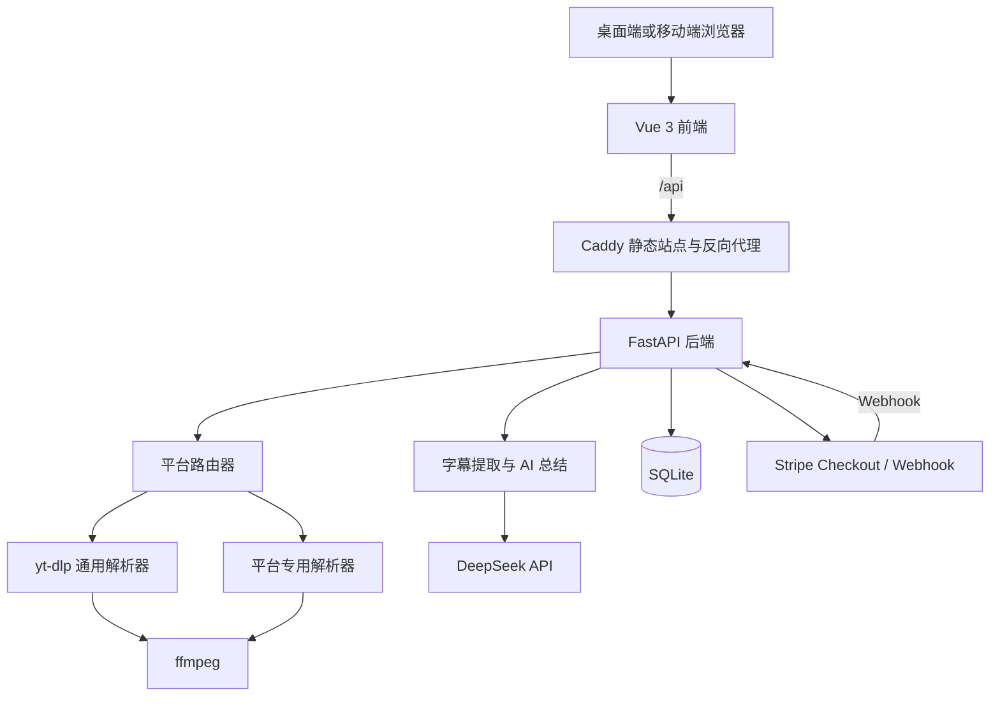

# 镜读

> AI 视频总结与内容提取平台

[在线体验](https://47.107.186.46/) | [后端健康检查](https://47.107.186.46/api/health)

镜读是一个前后端分离的视频内容处理平台。用户粘贴公开视频链接后，可以解析视频信息、选择清晰度并下载；对于带字幕的视频，还可以使用 AI 生成内容摘要、字幕文本、思维导图，并围绕视频内容进行问答。

项目基于 Vue 3、FastAPI、yt-dlp、DeepSeek、SQLite 和 Stripe 构建，提供中文、英语、法语和西班牙语界面，并包含 Docker、Caddy 与 HTTPS 生产部署配置。

## 目录

- [项目介绍](#项目介绍)
- [需求分析](#需求分析)
- [核心功能](#核心功能)
- [平台支持](#平台支持)
- [技术栈](#技术栈)
- [方案设计](#方案设计)
- [项目结构](#项目结构)
- [本地运行指南](#本地运行指南)
- [Stripe 本地支付测试](#stripe-本地支付测试)
- [Docker 生产部署](#docker-生产部署)
- [API 概览](#api-概览)
- [常见问题](#常见问题)
- [后续规划](#后续规划)
- [合规与安全说明](#合规与安全说明)

## 项目介绍

在线视频分散在不同平台，下载方式、字幕格式和清晰度规则并不统一。长视频还存在信息密度低、观看成本高的问题。镜读将视频解析、下载、字幕提取和 AI 内容理解整合在一个页面中，让用户可以先理解内容，再决定如何保存和使用。

### 项目目标

1. 使用统一入口解析多个视频、音频和社交媒体平台的公开链接。
2. 展示标题、封面、时长、作者、来源平台和可用格式。
3. 为公开视频提供直链或服务端下载能力。
4. 基于字幕生成摘要、思维导图和视频问答结果。
5. 通过用户、额度、会员和支付体系支持产品化运营。
6. 提供多语言、响应式和可部署的完整 Web 体验。

### 项目特点

- 基于 yt-dlp 的通用平台解析能力。
- 针对 Bilibili、抖音、快手、爱奇艺、优酷等平台增加适配或兜底逻辑。
- DeepSeek 流式生成 AI 摘要、思维导图和问答内容。
- 字幕支持 SRT、VTT 和 TXT 导出。
- 邮箱注册登录、JWT 身份认证和免费额度控制。
- Stripe Checkout、Webhook 和支付回跳确认。
- 中文、英语、法语、西班牙语四语言界面。
- Docker Compose、Caddy、HTTP/2、HTTP/3 和自动 HTTPS。

## 需求分析

### 项目背景

目标用户通常需要完成以下任务：

- 保存自己发布或已经获得授权的视频。
- 下载公开许可的课程、演讲或素材，用于离线学习。
- 在观看长视频前快速了解主题、大纲和核心结论。
- 提取字幕并整理成笔记、思维导图或可检索文本。
- 使用一个统一工具处理不同平台的公开视频链接。

### 目标用户

| 用户类型 | 主要诉求 |
| --- | --- |
| 学习者 | 快速总结课程、讲座和访谈，提取字幕与知识结构 |
| 内容创作者 | 备份自己的作品，整理已授权素材和选题信息 |
| 研究人员 | 将公开视频内容转换为文本，辅助检索和分析 |
| 普通用户 | 在电脑或手机浏览器中解析并保存可合法下载的内容 |
| 平台运营者 | 通过免费额度、VIP 和支付功能运营工具型产品 |

### 功能需求

| 优先级 | 功能 | 需求说明 | 当前状态 |
| --- | --- | --- | --- |
| P0 | 视频解析 | 输入链接后返回标题、封面、时长、作者、平台和格式 | 已实现 |
| P0 | 视频下载 | 根据所选格式获取直链或由服务端下载文件 | 已实现 |
| P0 | 多平台支持 | 使用通用引擎并对部分平台做专项适配 | 已实现 |
| P1 | AI 视频总结 | 根据字幕流式生成摘要、提纲和核心观点 | 已实现 |
| P1 | 字幕提取 | 展示时间轴字幕并导出 SRT、VTT、TXT | 已实现 |
| P1 | 思维导图 | 根据字幕生成并导出 PNG、SVG 思维导图 | 已实现 |
| P1 | 视频问答 | 基于字幕上下文回答用户问题 | 已实现 |
| P1 | 用户系统 | 邮箱注册、登录、JWT 鉴权和用户状态查询 | 已实现 |
| P1 | 多语言 | 支持中文、英语、法语和西班牙语界面 | 已实现 |
| P1 | 响应式布局 | 兼容桌面端和移动端浏览器 | 已实现 |
| P2 | 会员体系 | 免费用户每日 3 次 AI 总结，VIP 不限次数 | 已实现 |
| P2 | 在线支付 | Stripe Checkout、Webhook、订单和会员激活 | 已实现 |
| P2 | 批量任务 | 批量解析、下载和总结多个链接 | 规划中 |
| P2 | 无字幕转写 | 使用 Whisper 为无字幕视频生成文本 | 规划中 |

### 非功能需求

- **易用性**：用户粘贴链接后即可解析，不要求了解平台格式规则。
- **性能**：普通视频解析目标响应时间在 10 秒以内；实际时间受目标平台和网络影响。
- **兼容性**：支持现代 Chrome、Edge、Firefox、Safari 和移动端浏览器。
- **可维护性**：平台专项解析器与通用 yt-dlp 封装分离，便于独立更新。
- **安全性**：密码使用 bcrypt 哈希，JWT 有效期为 72 小时，Webhook 校验 Stripe 签名。
- **可靠性**：订单完成操作具备幂等保护，避免重复回调造成重复开通。
- **可部署性**：提供 Docker 镜像、健康检查、数据卷、反向代理和 HTTPS 配置。

### 业务边界

- 仅面向公开、非 DRM、当前网络区域可访问的内容。
- 不绕过登录、会员、付费、地区版权或数字版权管理限制。
- AI 总结依赖可提取的字幕；没有字幕的视频目前无法生成可靠总结。
- “支持 1800+ 平台”来自 yt-dlp 的提取器覆盖范围，不代表每个平台、每个链接或每种受限内容都始终可用。

## 核心功能

### 1. 视频解析与下载

- 自动识别目标平台。
- 展示标题、封面、作者、时长、播放量和视频描述。
- 列出可用分辨率、封装格式、音视频状态和文件大小。
- 支持服务端下载和部分平台直链获取。
- 使用 ffmpeg 合并分离的视频流与音频流。

### 2. AI 视频总结

- 优先提取人工字幕，缺失时尝试自动字幕。
- 使用 SSE 实时推送字幕、摘要和思维导图结果。
- 根据界面语言生成中文、英文、法文或西班牙文内容。
- 免费用户每日可生成 3 次总结，VIP 用户不限制次数。

### 3. 字幕与思维导图

- 展示带时间戳的字幕段落。
- 导出 SRT、VTT 和纯文本字幕。
- 使用 Markmap 渲染可缩放、可拖拽的思维导图。
- 支持导出高清 PNG 和 SVG 文件。

### 4. AI 视频问答

- 使用当前视频字幕作为上下文。
- 问答结果以流式形式返回。
- 支持针对知识点、结论、步骤和观点进行追问。

### 5. 用户与会员

- 邮箱和密码注册、登录。
- bcrypt 密码哈希与 JWT Bearer Token。
- SQLite 保存用户、额度和订单。
- Stripe 支付成功后自动激活一个月 VIP。
- Webhook 为主确认链路，支付成功页主动查询作为兜底。

### 6. 国际化与生产部署

- 内置 `zh`、`en`、`fr`、`es` 四种语言。
- Vite 开发代理统一转发 `/api` 请求。
- 生产环境由 Caddy 托管前端并反向代理 FastAPI。
- 支持域名或公网 IP 的自动 HTTPS 和 HTTP 到 HTTPS 跳转。

## 平台支持

镜读通过 yt-dlp 通用解析器、平台请求头适配和专用解析模块协同工作。

| 分类 | 示例平台 |
| --- | --- |
| 视频平台 | YouTube、Bilibili、抖音、TikTok、爱奇艺、优酷、芒果TV、腾讯视频、快手、Vimeo、Dailymotion、Twitch、Niconico、微博视频 |
| 音频平台 | SoundCloud、Bandcamp、Mixcloud、Audiomack、Podcast、YouTube Music |
| 社交媒体 | Instagram、Facebook、X/Twitter、Reddit、Pinterest、Tumblr、LinkedIn |

### 重点平台适配

| 平台 | 处理方式 | 说明 |
| --- | --- | --- |
| Bilibili | yt-dlp + B 站公开 API 兜底 | 降低页面请求出现 HTTP 412 时的失败概率 |
| 抖音 | 专用解析模块 | 处理常见分享链接和公开视频地址 |
| 快手 | 专用解析模块 + yt-dlp 兜底 | 兼容分享短链和详情页 |
| 爱奇艺 | 专用页面/HLS 解析 | 仅支持公开、非 DRM、当前地区可播放的内容 |
| 优酷 | 专用页面/HLS 解析 | 仅支持公开、非 DRM、当前地区可播放的内容 |
| 芒果TV、腾讯视频 | 平台请求头和 HLS 格式适配 | 结果取决于页面状态、地区和 yt-dlp 支持情况 |

平台页面和接口会持续变化。遇到解析失败时，应先确认链接在普通浏览器中可以公开播放，再升级 yt-dlp 并查看后端错误信息。

## 技术栈

### 前端

| 技术 | 用途 |
| --- | --- |
| Vue 3 | 组件化界面与响应式状态 |
| Vite 7 | 开发服务器和生产构建 |
| Tailwind CSS 4 | 页面样式和响应式布局 |
| Axios | 普通 HTTP API 请求 |
| Marked | Markdown 摘要渲染 |
| Markmap | 思维导图生成、交互与导出 |
| 自研 i18n 模块 | 中、英、法、西四语言切换 |

### 后端

| 技术 | 用途 |
| --- | --- |
| FastAPI | REST API、SSE 和 OpenAPI 文档 |
| Uvicorn | ASGI 服务 |
| yt-dlp | 多平台视频信息和媒体流提取 |
| ffmpeg | 音视频合并与格式处理 |
| DeepSeek API | 视频总结、思维导图和问答 |
| SQLite | 用户、额度和订单数据 |
| bcrypt + PyJWT | 密码哈希和身份认证 |
| Stripe SDK | Checkout、Webhook 和支付确认 |
| httpx / requests | 平台接口和媒体请求 |

### 部署

| 技术 | 用途 |
| --- | --- |
| Docker Compose | 编排前端和后端容器 |
| Caddy | 静态文件、反向代理和自动 HTTPS |
| Docker Volume | 保存 Caddy 证书和配置 |
| Bind Mount | 持久化 SQLite 数据与下载目录 |

## 方案设计

### 总体架构



本地开发时，浏览器直接访问 Vite 的 `5173` 端口，Vite 将 `/api` 转发到 FastAPI 的 `8001` 端口。生产环境中，Caddy 统一监听 `80/443`，前端静态资源和后端 API 使用同一站点地址。

### 模块划分

| 模块 | 主要职责 |
| --- | --- |
| `backend/main.py` | FastAPI 入口、解析路由、下载路由和平台分发 |
| `backend/downloader.py` | yt-dlp 封装、Bilibili 兜底、格式归一化 |
| `backend/douyin.py` | 抖音专用解析与下载 |
| `backend/kuaishou.py` | 快手专用解析、直链和下载 |
| `backend/iqiyi.py` | 爱奇艺页面、HLS 播放列表和下载处理 |
| `backend/youku.py` | 优酷页面和 HLS 解析 |
| `backend/summarizer.py` | 字幕提取、DeepSeek 总结、思维导图和问答 |
| `backend/api_auth.py` | 注册、登录和用户状态 API |
| `backend/api_payment.py` | Stripe Checkout、Webhook、订单和支付确认 |
| `backend/database.py` | SQLite 表结构、用户额度和订单事务 |
| `frontend/src/App.vue` | 页面状态、解析下载、认证和支付流程编排 |
| `frontend/src/components/VideoSummary.vue` | 摘要、字幕、思维导图和 AI 问答 |
| `frontend/src/i18n.js` | 多语言文案和语言状态 |

### 视频解析与下载流程

1. 前端将链接提交到 `POST /api/parse`。
2. 后端识别平台并选择专用解析器或 yt-dlp。
3. 解析器将不同平台的返回结果转换为统一视频数据结构。
4. 前端展示视频元数据和格式列表。
5. 用户选择格式后，前端调用 `POST /api/download`。
6. 后端下载媒体流，必要时调用 ffmpeg 合并音视频，再返回文件。

### AI 总结流程

1. 已登录用户提交视频链接和输出语言。
2. 后端检查免费额度或 VIP 状态。
3. 字幕提取器优先选择人工字幕，其次选择自动字幕。
4. DeepSeek 流式生成总结，后端通过 SSE 逐段推送。
5. 后端继续生成思维导图 Markdown。
6. 前端渲染摘要、字幕和 Markmap，并提供导出功能。

SSE 事件包括：

- `subtitle`：字幕语言、类型、完整文本和时间轴分段。
- `summary`：逐段生成的摘要内容。
- `mindmap`：思维导图 Markdown。
- `quota`：免费用户剩余额度。
- `done`：本次生成完成。
- `error`：错误信息和登录或会员提示。

### 支付与会员流程

1. 已登录用户请求创建 Stripe Checkout Session。
2. 后端先创建本地 `pending` 订单，再创建 Stripe 会话。
3. 用户在 Stripe 页面完成支付。
4. Stripe Webhook 校验签名并将订单更新为 `paid`。
5. 后端以事务方式激活或顺延一个月 VIP。
6. 支付成功页调用确认接口，处理 Webhook 延迟等情况。

### 数据设计

SQLite 在后端首次启动时自动创建：

| 表 | 关键字段 | 用途 |
| --- | --- | --- |
| `users` | `email`、`password_hash`、`is_vip`、`vip_expire_at`、`daily_summary_count` | 用户、认证、会员和免费额度 |
| `orders` | `order_no`、`user_id`、`status`、`stripe_session_id`、`paid_at` | Stripe 订单和支付状态 |

数据库文件默认位于 `backend/data/app.db`。

## 项目结构

```text
free-video-downloader-master/
├── backend/
│   ├── main.py                 # FastAPI 入口和视频 API
│   ├── downloader.py           # yt-dlp 通用解析与 B 站兜底
│   ├── platforms.py            # 支持平台元数据
│   ├── china_platforms.py      # 国内平台识别和请求参数
│   ├── douyin.py               # 抖音适配
│   ├── kuaishou.py             # 快手适配
│   ├── iqiyi.py                # 爱奇艺适配
│   ├── youku.py                # 优酷适配
│   ├── site_775069.py          # 自定义站点适配器
│   ├── summarizer.py           # 字幕提取和 AI 能力
│   ├── api_summarize.py        # 总结与问答 SSE API
│   ├── api_auth.py             # 用户认证 API
│   ├── api_payment.py          # 支付 API
│   ├── auth.py                 # JWT 与密码处理
│   ├── database.py             # SQLite 数据访问
│   ├── requirements.txt        # Python 依赖
│   ├── data/                   # SQLite 数据目录
│   └── downloads/              # 临时下载目录
├── frontend/
│   ├── src/
│   │   ├── App.vue
│   │   ├── i18n.js
│   │   ├── api/
│   │   └── components/
│   ├── public/
│   ├── package.json
│   ├── vite.config.js
│   ├── Dockerfile
│   └── Caddyfile
├── deploy/
│   ├── deploy.sh               # SSH/rsync 远程部署脚本
│   └── docker-daemon-cn.json   # Docker 国内镜像配置示例
├── compose.yaml                # 生产容器编排
├── .env.production.example     # 生产环境变量模板
└── README.md
```

## 本地运行指南

### 1. 环境要求

| 工具 | 推荐版本 | 检查命令 | 用途 |
| --- | --- | --- | --- |
| Python | 3.10 及以上，推荐 3.12 | `python3 --version` | FastAPI 后端 |
| Node.js | `^20.19.0` 或 `>=22.12.0` | `node -v` | Vite 7 前端 |
| npm | 9 及以上 | `npm -v` | 前端依赖 |
| ffmpeg | 当前稳定版 | `ffmpeg -version` | 合并音视频 |
| Git | 当前稳定版 | `git --version` | 源码管理 |

ffmpeg 不是后端启动的硬性条件，但缺少它时，分离音视频流的高清格式可能无法正常合并。

常见安装方式：

```bash
# macOS（已安装 Homebrew）
brew install ffmpeg

# Ubuntu / Debian
sudo apt update
sudo apt install -y ffmpeg

# Windows（winget）
winget install Gyan.FFmpeg
```

如果 macOS 没有 Homebrew，可以从 [ffmpeg.org](https://ffmpeg.org/download.html) 获取构建版本，安装后确保 `ffmpeg` 位于 `PATH` 中。

### 2. 进入项目

下载或克隆源码后进入项目根目录：

```bash
cd free-video-downloader-master
```

### 3. 创建后端虚拟环境

macOS / Linux：

```bash
cd backend
python3 -m venv .venv
source .venv/bin/activate
python -m pip install --upgrade pip
pip install -r requirements.txt
```

Windows PowerShell：

```powershell
cd backend
py -m venv .venv
.\.venv\Scripts\Activate.ps1
python -m pip install --upgrade pip
pip install -r requirements.txt
```

网络较慢时可以使用可信的 Python 镜像源：

```bash
pip install -r requirements.txt -i https://pypi.tuna.tsinghua.edu.cn/simple
```

### 4. 配置后端环境变量

在 `backend` 目录创建 `.env`：

```env
# AI 总结需要；仅解析和下载时可暂不配置
DEEPSEEK_API_KEY=sk-your-deepseek-key

# 本地开发也建议使用随机值
JWT_SECRET=replace-with-a-long-random-secret

# 本地前端地址和 CORS 白名单
FRONTEND_URL=http://localhost:5173
CORS_ORIGINS=http://localhost:5173,http://127.0.0.1:5173

# Stripe 为可选配置
STRIPE_SECRET_KEY=sk_test_replace_me
STRIPE_PRICE_ID_MONTHLY=price_replace_me
STRIPE_WEBHOOK_SECRET=whsec_replace_me
```

可以使用以下命令生成 JWT 密钥：

```bash
python -c "import secrets; print(secrets.token_hex(48))"
```

不要提交 `.env`、`.env.production`、Stripe 密钥或 DeepSeek 密钥。

### 5. 启动后端

确认终端位于 `backend` 目录且虚拟环境已激活：

```bash
python main.py
```

后端默认地址：

- API：<http://localhost:8001>
- 健康检查：<http://localhost:8001/api/health>
- Swagger UI：<http://localhost:8001/docs>
- ReDoc：<http://localhost:8001/redoc>

首次启动会自动创建 `backend/data/app.db`，不需要单独安装数据库。

### 6. 安装并启动前端

打开第二个终端：

```bash
cd frontend
npm install
npm run dev
```

如果 npm 下载较慢：

```bash
npm config set registry https://registry.npmmirror.com
npm install
```

浏览器访问：

<http://localhost:5173/>

Vite 会自动将 `/api` 请求代理到 `http://localhost:8001`。

### 7. 快速体验

1. 打开首页并粘贴一个公开的视频链接。
2. 点击“解析视频”，等待视频信息和格式列表出现。
3. 选择清晰度后下载视频。
4. 注册并登录账号。
5. 对带字幕的视频使用 AI 总结、字幕、思维导图和问答功能。
6. 在页面右上角切换中文、英语、法语或西班牙语。

### 8. 停止服务

在前后端终端分别按 `Ctrl + C`。

SQLite 数据保留在 `backend/data/app.db`。如果需要重置本地数据，先停止后端，再删除该文件，后端下次启动时会重新建表。

## Stripe 本地支付测试

支付功能不是解析和总结功能的必需项。需要测试会员购买时，再配置 Stripe 测试模式。

### 1. 准备 Stripe 配置

1. 在 Stripe Dashboard 开启测试模式。
2. 创建“镜读 VIP 月度会员”产品和一次性价格。
3. 将 Secret Key 和 Price ID 写入 `backend/.env`。
4. 确保 Price ID、币种和前端展示价格一致。

### 2. 安装并登录 Stripe CLI

按照 [Stripe CLI 官方文档](https://docs.stripe.com/stripe-cli) 安装后执行：

```bash
stripe login
```

如果出现网络超时，需要先确认当前网络可以访问 `dashboard.stripe.com:443`。

### 3. 转发本地 Webhook

保持前后端运行，再开启一个终端：

```bash
stripe listen --forward-to localhost:8001/api/payment/webhook
```

将 Stripe CLI 输出的 `whsec_...` 写入 `backend/.env` 的 `STRIPE_WEBHOOK_SECRET`，然后重启后端。

Stripe 测试卡可使用：

```text
卡号：4242 4242 4242 4242
有效期：任意未来日期
CVC：任意三位数字
```

支付完成后，系统优先通过 Webhook 激活会员；前端回到成功页后还会调用确认接口作为兜底。

## Docker 生产部署

本项目的 Compose 配置面向域名或公网 IP 部署。本地开发建议使用前后端开发服务器。

### 1. 服务器要求

- Linux x86_64 或 arm64 服务器。
- 已安装 Docker Engine 和 Docker Compose V2。
- 安全组或防火墙已开放 TCP `80`、TCP `443`；HTTP/3 可额外开放 UDP `443`。
- 公网 IP 或已经解析到服务器的域名。

### 2. 创建生产环境变量

```bash
cp .env.production.example .env.production
```

示例：

```env
SITE_ADDRESS=example.com
FRONTEND_URL=https://example.com
CORS_ORIGINS=https://example.com

JWT_SECRET=replace-with-a-long-random-secret
DEEPSEEK_API_KEY=sk-your-deepseek-key

STRIPE_SECRET_KEY=sk_live_or_test_replace_me
STRIPE_PRICE_ID_MONTHLY=price_replace_me
STRIPE_WEBHOOK_SECRET=whsec_replace_me
```

没有域名时，`SITE_ADDRESS` 也可以填写受支持的公网 IP，例如：

```env
SITE_ADDRESS=203.0.113.10
FRONTEND_URL=https://203.0.113.10
CORS_ORIGINS=https://203.0.113.10
```

### 3. 启动容器

```bash
sudo docker compose --env-file .env.production up -d --build
sudo docker compose --env-file .env.production ps
```

查看日志：

```bash
sudo docker compose --env-file .env.production logs -f
```

停止服务：

```bash
sudo docker compose --env-file .env.production down
```

`backend/data` 和 `backend/downloads` 使用宿主机目录持久化；Caddy 证书保存在 Docker Volume 中。执行 `down` 不会删除这些数据，除非显式增加 `-v`。

### 4. 配置生产 Stripe Webhook

在 Stripe Dashboard 创建 Webhook Endpoint：

```text
https://example.com/api/payment/webhook
```

至少订阅：

- `checkout.session.completed`
- `checkout.session.async_payment_succeeded`

将该 Endpoint 的 Signing Secret 写入 `.env.production`，再重启后端。

### 5. 使用远程部署脚本

仓库中的 `deploy/deploy.sh` 使用 SSH、rsync 和 Docker Compose 同步并重建服务：

```bash
DEPLOY_HOST=203.0.113.10 \
DEPLOY_USER=admin \
SSH_KEY=~/.ssh/id_ed25519 \
./deploy/deploy.sh
```

可用参数：

| 变量 | 默认值 | 说明 |
| --- | --- | --- |
| `DEPLOY_HOST` | 无 | 必填，服务器 IP 或域名 |
| `DEPLOY_USER` | `root` | SSH 用户 |
| `DEPLOY_PORT` | `22` | SSH 端口 |
| `DEPLOY_PATH` | `/home/<user>/jingdu` | 远程部署目录 |
| `SSH_KEY` | 空 | SSH 私钥路径 |
| `KNOWN_HOSTS_FILE` | `.deploy-keys/known_hosts` | SSH 主机指纹文件 |
| `DB_SNAPSHOT` | 空 | 可选，仅首次迁移时上传 SQLite 快照 |

不要在日常更新中随意设置 `DB_SNAPSHOT`，否则可能用本地快照覆盖服务器现有数据库。

## 环境变量

| 变量 | 本地必需 | 生产必需 | 说明 |
| --- | --- | --- | --- |
| `DEEPSEEK_API_KEY` | AI 功能必需 | AI 功能必需 | DeepSeek API Key |
| `JWT_SECRET` | 建议 | 是 | JWT HS256 签名密钥 |
| `CORS_ORIGINS` | 否 | 是 | 允许的前端来源，多个值用逗号分隔 |
| `FRONTEND_URL` | 支付时必需 | 支付时必需 | Stripe 成功和取消回跳地址 |
| `STRIPE_SECRET_KEY` | 支付时必需 | 支付时必需 | Stripe Secret Key |
| `STRIPE_PRICE_ID_MONTHLY` | 支付时必需 | 支付时必需 | Stripe 月度套餐 Price ID |
| `STRIPE_WEBHOOK_SECRET` | Webhook 必需 | Webhook 必需 | Stripe Endpoint Signing Secret |
| `SITE_ADDRESS` | 否 | 是 | Caddy 站点域名或公网 IP |

## API 概览

FastAPI 会在 `/docs` 自动生成完整的交互式接口文档。

### 视频与平台

| 方法 | 路径 | 说明 |
| --- | --- | --- |
| `GET` | `/api/health` | 服务健康检查 |
| `GET` | `/api/platforms` | 返回平台分组、yt-dlp 版本和提取器数量 |
| `POST` | `/api/parse` | 解析视频元数据和格式 |
| `POST` | `/api/download` | 下载指定格式并返回文件 |
| `POST` | `/api/direct-url` | 获取可用的媒体直链 |
| `GET` | `/api/proxy/thumbnail` | 代理获取存在防盗链的缩略图 |

解析请求示例：

```json
{
  "url": "https://www.youtube.com/watch?v=VIDEO_ID"
}
```

下载请求示例：

```json
{
  "url": "https://www.youtube.com/watch?v=VIDEO_ID",
  "format_id": "bestvideo+bestaudio/best"
}
```

### AI 总结

| 方法 | 路径 | 说明 |
| --- | --- | --- |
| `POST` | `/api/summarize` | SSE 视频字幕、摘要和思维导图 |
| `POST` | `/api/chat` | SSE 视频内容问答 |

总结请求示例：

```json
{
  "url": "https://www.bilibili.com/video/BV_EXAMPLE",
  "language": "zh"
}
```

### 用户认证

| 方法 | 路径 | 说明 |
| --- | --- | --- |
| `POST` | `/api/auth/register` | 邮箱和密码注册 |
| `POST` | `/api/auth/login` | 登录并获取 JWT |
| `GET` | `/api/auth/me` | 查询当前用户和 VIP 状态 |

密码长度要求为 6 到 50 位。需要身份认证的接口使用：

```http
Authorization: Bearer <token>
```

### 支付

| 方法 | 路径 | 说明 |
| --- | --- | --- |
| `POST` | `/api/payment/create-checkout` | 创建 Stripe Checkout Session |
| `POST` | `/api/payment/confirm` | 支付回跳后的主动确认 |
| `POST` | `/api/payment/webhook` | 接收并校验 Stripe Webhook |
| `GET` | `/api/payment/orders` | 查询当前用户订单 |

## 常见问题

### Bilibili 返回 HTTP 412

项目会在 yt-dlp 失败时尝试 Bilibili 公开 API 兜底，但平台风控、请求频率和网络出口仍可能影响结果。

```bash
cd backend
source .venv/bin/activate
pip install --upgrade yt-dlp
```

确认使用标准视频详情页或包含 BV 号的链接，并降低重复请求频率。

### 爱奇艺、优酷、芒果TV 或腾讯视频找不到视频

先确认：

1. 链接是单个视频详情页，而不是首页、频道页或搜索页。
2. 视频无需登录、VIP 或付费权限。
3. 视频未启用 DRM。
4. 当前服务器所在地区可以正常播放。
5. 已升级到当前项目要求的 yt-dlp 版本。

上述限制无法通过更换请求参数合法绕过。

### 视频可以解析，但下载后没有声音

通常是选择了仅视频格式，或本机没有安装 ffmpeg。安装 ffmpeg 后重启后端，并选择带音频的格式。

### AI 总结提示没有字幕

AI 总结依赖平台字幕。当前版本不会自动对无字幕视频执行语音识别，可更换带人工或自动字幕的视频。

### 前端请求后端失败或出现 CORS 错误

- 确认后端运行在 `http://localhost:8001`。
- 确认前端通过 `http://localhost:5173` 访问。
- 检查 `backend/.env` 中的 `CORS_ORIGINS`。
- 修改 `.env` 后需要重启后端。

### 端口被占用

macOS / Linux：

```bash
lsof -i :8001
lsof -i :5173
```

结束对应进程，或修改 `backend/main.py` 与 `frontend/vite.config.js` 中的端口和代理配置。

### 注册返回 500

检查：

- `backend/data` 目录是否可写。
- 后端启动日志中是否成功初始化 SQLite。
- Python 依赖是否完整安装。
- 数据库文件是否损坏。

SQLite 完整性检查：

```bash
sqlite3 backend/data/app.db "PRAGMA integrity_check;"
```

### 支付成功后仍显示普通用户

依次检查：

1. Stripe Webhook Endpoint 是否指向 `/api/payment/webhook`。
2. `STRIPE_WEBHOOK_SECRET` 是否属于当前 Endpoint 和当前模式。
3. Stripe Price 与 Secret Key 是否同为测试模式或同为正式模式。
4. Webhook 是否收到 `checkout.session.completed`。
5. 订单的 `status` 是否已经变为 `paid`。
6. 支付成功页是否调用 `/api/payment/confirm` 并刷新 `/api/auth/me`。

## 后续规划

- 使用 Whisper 为无字幕视频提供语音转文字。
- 增加后台任务队列、下载进度和失败重试。
- 支持批量链接、播放列表和任务历史。
- 增加字幕翻译、摘要模板和多模型选择。
- 增加管理后台、运营统计和订单管理。
- 为平台解析器补充自动化回归样例和可用性监控。
- 引入对象存储，减少大文件对应用服务器磁盘的占用。

## 合规与安全说明

本项目仅用于技术学习、内容研究和处理用户有权访问的资料。使用者应确保自己拥有内容版权、已经取得授权，或目标平台明确允许保存和使用该内容。

请勿使用本项目：

- 下载、传播或商业使用未经授权的受版权保护内容。
- 绕过登录、付费、会员、地区限制或 DRM。
- 批量抓取并影响目标平台的正常服务。
- 处理包含隐私、机密或其他不应上传至第三方 AI 服务的信息。

生产部署时还应：

- 使用足够长的随机 `JWT_SECRET`。
- 只在服务端保存 DeepSeek 和 Stripe 密钥。
- 为 `CORS_ORIGINS` 配置明确的站点白名单。
- 定期备份 `backend/data/app.db`。
- 监控下载目录空间，并按业务需要增加定期清理策略。
- 遵守目标平台服务条款以及所在国家或地区的法律法规。
